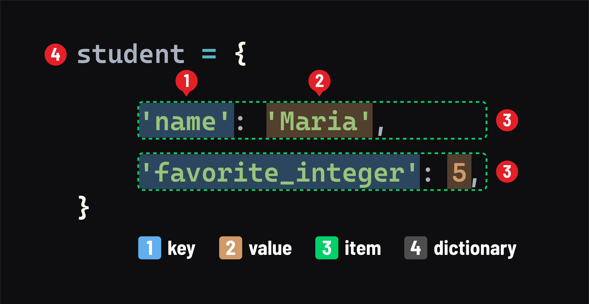

<h1>
  <span class="headline">Data Structures</span>
  <span class="subhead">Dictionaries</span>
</h1>

**Learning objective:** By the end of this lesson, students will be able to understand the concept of dictionaries in Python, differentiate them from other data structures, and demonstrate how to create and manipulate dictionaries.

## What are dictionaries?

***Dictionaries*** in Python are similar to ***objects*** in JavaScript. Dictionaries are collections of ***items***, like objects, which are collections of ***properties*** in JavaScript.

Dictionaries have a class (type) of `dict`.

## Basic syntax

As with objects in JavaScript, a dictionary literal is created using curly braces:



1. A key
2. A value
3. An item - or a `key: value` pair
4. The dictionary itself

Any immutable type (like a number) can be used as a key. Unlike in JavaScript, when strings are used as keys, they must be surrounded in quotes, as they are above. The value held by a variable can also be used as a key - this is a common pitfall for JavaScript developers new to Python:

```python
favorite_animal = 'dog'

student = {
    'name': 'Maria',
    'favorite_integer': 5,
    favorite_animal: 'llama' # notice the lack of quotes around favorite_animal
}

print(student)
# prints: {'name': 'Maria', 'favorite_integer': 5, 'dog': 'llama'}
# note the 'dog' key - the value of the favorite_animal variable is used
```

## Accessing items in dictionaries

### Getting values

We use square brackets to get an item's value:

```python
name = student['name']
print(name)
# prints: Maria
```

Unlike JavaScript, we can't access items in a Python dictionary using dot notation (dots are exclusively used to invoke methods on a dictionary in Python).

### The `get` method

When attempting to access a key that does not exist in a dictionary, a `KeyError` will be raised.

One option to avoid this error is to use the `get` method:

```python
favorite_food = student['favorite_food']
# error: KeyError: 'favorite_food'

print(student.get('favorite_food'))
# prints: None
```

### The `in` operator

Another way to avoid the `KeyError` is to use the `in` operator to check if the dictionary includes a key:

```python
if 'course' in student:
    print(f"{student['name']} is enrolled in {student['course']}")
else:
    print(f"{student['name']} is not enrolled in a course")
    # prints: Maria is not enrolled in a course
```

## Mutation

Dictionaries are mutable:

- The values assigned to a key can be changed.
- Additional items can be added.
- Existing items can be deleted.

### Setting items

We not only use square brackets to get an item's value - we also use it to set an item's value:

```python
student['name'] = 'Mariana'
print(student['name'])
# prints: Mariana
```

### Adding items

Assigning to a ***key*** that does not exist will create a new item in the dictionary.

Let's add an item to the `student` dictionary:

```python
student['age'] = 25
```

### Deleting items

The `del` statement is used to delete an item from a dictionary:

```python
del student['dog']
# verify that the item was deleted
print('dog' in student)
# prints: False
```

## Number of items

Use the built-in `len` function to retrieve the number of items in a dictionary:

```python
print(student)
# prints: {'name': 'Maria', 'favorite_integer': 5, 'age': 25}
print(len(student))
# prints: 3
print(len({}))
# prints: 0
```

## Iterating through dictionaries

`for` loops are used to iterate over the items in a dictionary.

However, accessing the value of an item as follows is considered to be a Python [anti-pattern](https://en.wikipedia.org/wiki/Anti-pattern):

```python
for key in student:
    print(f"{key} is {student[key]}")
    # prints:
    # name is Maria
    # favorite_integer is 5
    # age is 25
```

Modifying a dictionary using this approach can lead to potential issues, which is why this is not preferred.

The preferred approach is to use the `items()` method to obtain a [dictionary view object](https://docs.python.org/3/library/stdtypes.html#dictionary-view-objects).

Use it in a `for in` loop to iterate over the view object:

```python
for key, val in student.items():
    print(f"{key} is {val}")
    # prints:
    # name is Maria
    # favorite_integer is 5
    # age is 25
```

The `for` statement assigns values to multiple variables like with `key, val` above through a mechanism called tuples, discussed later.

## 🎓 You Do

1. Define a Python dictionary named `where_my_things_are` containing a few items where:
    - the `keys` are things you have
    - the `values` are the locations where you keep those things
2. Write a `for` loop that iterates over the items in the dictionary and prints each one as:

   ***My [thing] is kept [location]***
